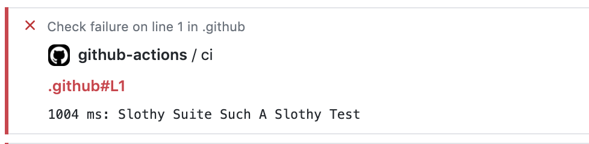

# mocha-sloth-reporter

Mocha reporter to detect slow tests and display to github actions if enabled

## Getting Started

### Installing

```
npm install --save-dev mocha-sloth-reporter
```

### How To Use

    mocha --reporter mocha-sloth-reporter

#### Parametes 

`--slow <Integer>`
  - Default: 75 ms
  - Display:
    - If test is higher than value then it will be displayed in yellow
    - If test is higher than double the value then it will be displayed in red
  - Example:
    ```
    mocha --reporter mocha-sloth-reporter --slow 100
    ```

`--actions <boolean>`
  - Default: false
  - Display:
    - If test is higher than value then it will be displayed as warning if actions enabled
    - If test is higher than double the value then it will be displayed as error if actions enabled
  - Example:
    ```
    mocha --reporter mocha-sloth-reporter --actions true
    ```
    
### Output

#### Console Output

```
Slothy Test Count: 1

1006 ms Slothy Suite Such A Slothy Test
```

#### Github Actions Annotations Output



## Contributing

TBD

## Authors

* **Edward Romero** - *Initial work*

## License

This project is licensed under the MIT License - see the [LICENSE](LICENSE) file for details

## Acknowledgments

* Original reporter was inspired by [catdad/mocha-slow-test-reporter](https://github.com/catdad/mocha-slow-test-reporter)